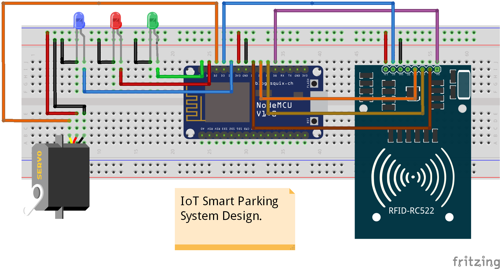
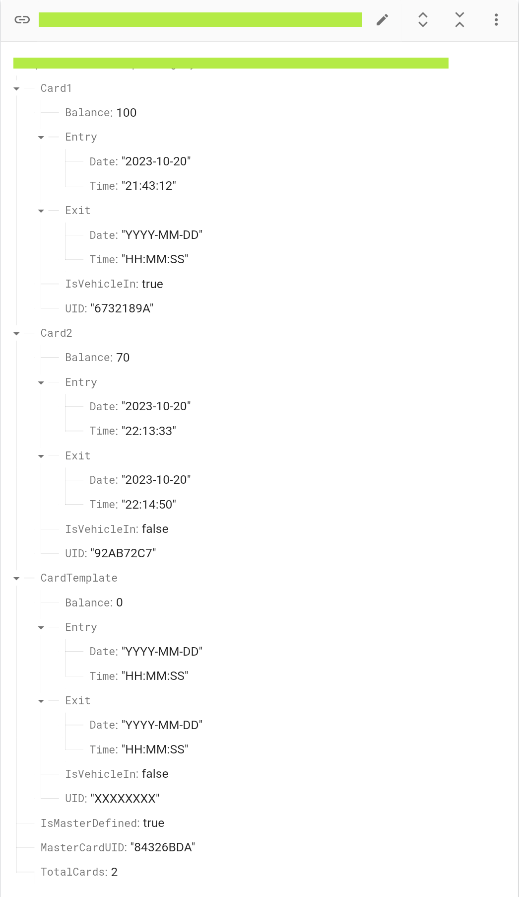

# IoT Smart Parking System

Early prototype of the IoT enabled smart parking system.

    
    

## Features :-

- One Mater login to manage all the user operations.
- Check for availability of the parking slot in real time.
- Dynamically deduct the charge from the user card based on the usage.
- Fuzzy business logic that can be expanded as per the scale of the project.
- Real time data view that let's other apps pull this information to do something usefull :)

## Hardware :-

- Servo Motor
- [MFRC522 Card Reader](https://robu.in/product/rc522-rfid-card-reader-module-13-56mhz/)
- [NodeMCU ESP-12E Dev Board](https://robu.in/product/nodemcu-cp2102-board/)
- RGB LED's and bunch of wires
- A USB cable for Power supply and programming

## Getting Started

Jumping to the project is super easy, just do the wiring connections and build the project with platform io vs code edition for arduino esp8266 framework. You can find the information below.

## Connections :-

Please refer the [wiring diagram](./hardware/Fritzing/SmartParking_WiringDiagram.png) inside the hardware directory. Also there is [fritzing workspace](./hardware/Fritzing/SmartParking_WiringDiagram.fzz) as well for changing pin mapping as per your convinience. If you wish to do so consider changing in [pins_config.h](./include/pins_config.h) file too. 

## Firebase Login :-

Please head over to [firebase](https://firebase.google.com/) sign up with your account and create a project if you don't have one. Once you've project onboard, create a real time database for data storage/retrieval in a real time. Please collect the [firebase host](./img/firebase_realtime_db.png) and [authentication key](./img/firebase_project_api_key.png) and provide to the code as described in project configurations below.

## Dependencies :-
- [MFRC522](https://github.com/miguelbalboa/rfid/tree/1.4.10)
- [NTPClient](https://github.com/arduino-libraries/NTPClient/tree/3.2.1)
- [ArduinoJson](https://github.com/bblanchon/ArduinoJson/tree/v5.13.4)
- [FirebaseArduino](https://github.com/FirebaseExtended/firebase-arduino/tree/v0.3) 
- [ESP8266 Core SDK](https://github.com/esp8266/Arduino/tree/2.7.4)

We strongly recommend to install the specified tagged versions of the libraries and Core SDK. Just hit the link above to see the exact versions for easy compilation.

**Note:** If you're installing `Espressif8266` platform in PIO Home consider installing `v2.6.3`.

## Project Configurations

Open the [arduino_secrets.h](./include/arduino_secrets.h) file.

- Set the Wi-Fi configurations
  - Set `SECRET_WIFI_SSID`
  - Set `SECRET_WIFI_PASS`

- Set the Firebase configurations
  - Set `SECRET_FIREBASE_HOST`
  - Set `SECRET_FIREBASE_AUTH`

## Build Flash Monitor

You can build, flash and monitor the app via platform io vs code edition as usual :)

## TODO

I'm dropping down few known todo's, if you have any such in mind please feel free to add them to the list

- Add ESP32 Support
- Add Wokwi Simulation Support
- Implementing a menu interface for Master login
- Location based parking services
- Web App for the user