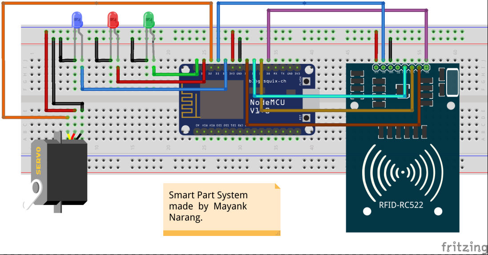

# IoT Smart Parking System

Early prototype of the IoT enabled smart parking system.

    

## Features :-
- One Mater Login to manage all the RFID cards/tags.
- Automatically check for availability of the parking slot.
- Dynamically deduct the charge from the card based on the usage.
- Real time database view that let's other apps use this information to do something :)

## Dependencies :-
- [MFRC522](https://github.com/miguelbalboa/rfid)
- [FirebaseArduino](https://github.com/FirebaseExtended/firebase-arduino) 
- [ESP8266 Core SDK](https://github.com/esp8266/Arduino)
- ESP8266 Dev Board

We recommend to install the latest versions of the libraries and Core SDK.